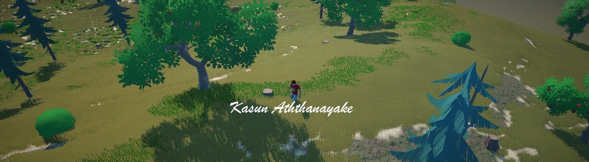

 
    

 

  

 
  
  

 
   

 

# Hi, I am Kasun (KAZ) 👋

I'm a tech enthusiast who would like to explore new technologies, not just programming languages but also devices.
I love to share knowledge with the rest of the world.
 
Since I'm a full-time Software Developer, I also like to share my code so others can make use of them.  
 

- 🔭 I’m currently working on developing **Game AI Algorithms** and **NPC Behaviour** Management...
- 🌱 I’m currently learning **Apple Vision Pro** & **Python** for Ethical Hacking and Pentesting
- 💬 Ask me about 🎮 Gaming/Game Dev & 📱 Mobile apps
- ⚡ Fun fact: Most of the logically advanced Games are developed using Unity Game Engine...

 

### 🤙🏻 Contact Me
<a href="mailto:kazcorei@gmail.com">✉️ kazcorei@gmail.com</a>
  
<a href="https://www.kazcore.com">🌐 www.kazcore.com</a>
  
 

### My Github Stats

<!--  -->

  
 

 <a href="https://github.com/ikazirus">
<!--    -->
 </a>

  

 
  
  
  

