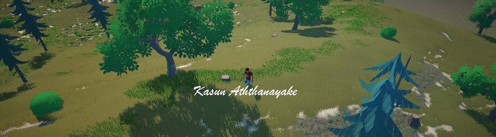
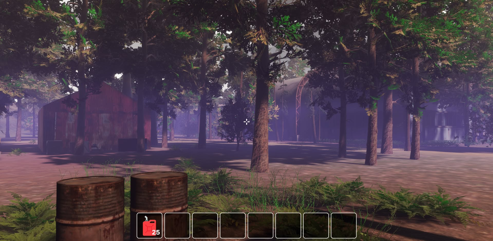

 
    

 
 

 

 
  
  

 

# Hi, I am Kasun (KAZ) 👋

I'm a tech enthusiast who would like to explore new technologies, not just programming languages but also devices.
I love to share knowledge with the rest of the world.
 
Since I'm a full-time Software Developer, I also like to share my code so others can make use of them.  
 

- 🔭 I’m currently working on developing **Game AI Algorithms** and **NPC Behaviour** Management...
- 🌱 I’m currently learning more **C++**, **Apple Vision Pro App Development** & **Python** for **Automation and Security**
- 💬 Ask me about 🎮 Gaming/Game Dev & 📱 Mobile apps
- ⚡ Fun fact: Most of the logically advanced Games are developed using **Unity** Game Engine...

 

 
<!--    -->
  
<!--    -->

 

 
    

 
